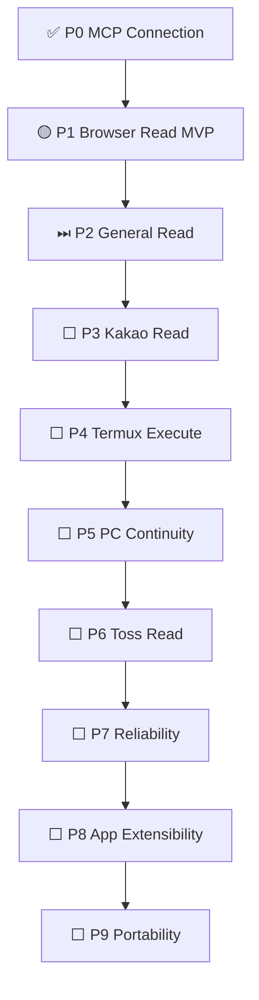

# ClosePaw · Project Dashboard (pilot)

> **Source of truth:** [PROGRESS.md](../../PROGRESS.md). This dashboard is a navigation view, not a second manual milestone ledger. Last seeded: 2026-10-09. **The table below is a baseline snapshot, not a live computation.**

## At a glance

| Area | Current position | Evidence / next gate |
| --- | --- | --- |
| Overall roadmap | **P0 verified; P1 active; P2 next; P3–P9 later** (1/10 milestone gates verified in PROGRESS.md) | [Milestone definitions](../../PROGRESS.md) |
| P0 · MCP connection | ✅ Verified | Phone ChatGPT text/voice → ClosePaw get_status |
| P1 · Browser read | 🟡 In progress | Galaxy **voice** browser read E2E and tunnel restart/network/reboot recovery remain to be verified |
| Signed release delivery | ⚠️ Verify independently | [Actions](../../actions), [Releases](../../releases); PR merge or CI success alone ≠ device install success |
| Latest release observed in audit | v0.1.33 (as of 2026-10-09 audit) | [Release history](../../releases) |
| Project board availability | ⬜ Not provisioned by this PR | Repository Issues currently disabled; configure Issues and GitHub Projects separately |

## Roadmap

## Three views to configure in GitHub Projects

Once Issues is enabled and a GitHub Project is created for this repository:

1. **Overview (table):** group by Milestone, columns Status, Priority, Owner, Validation, Evidence URL, Next Action.
2. **Execution (board):** group by Status: Backlog → Ready → In Progress → In Review → Blocked → Verified.
3. **Roadmap (timeline):** use Target Start/Target Date if there are real dates; do **not** fabricate deadlines.

Set status to **Verified** only after the end-user/real-device acceptance check and attach evidence. A merged PR, successful test suite, signed APK publication, and an installed/working Android release are four distinct facts.

## Work intake and handoff rules

- Before making changes, read [PROGRESS.md](../../PROGRESS.md), [Actions](../../actions), [Pull Requests](../../pulls), and [Releases](../../releases). Verify fresh facts; do not infer release success from document entries.
- Avoid duplicate work items: search PRs/issues for matching scope before opening an item.
- Each work item records: **Goal**, **Current state**, **Acceptance criteria**, **Evidence URLs**, **Blocker**, **Next action**.
- Update status at meaningful transitions, not after every minor tool call.
- New chat/Codex session: start from GitHub, not conversational memory. Leave a one-line handoff with the *one immediate next action*.
- Never mark a milestone verified based on code merge alone. Track uncertain status explicitly.
- Do not change signed release triggers, signing material, or production branches as part of dashboard administration.

## Provisioning checklist (requires GitHub project administration access)

- [ ] Enable repository Issues (currently disabled on 2026-10-09).
- [ ] Create **ClosePaw Delivery** GitHub Project owned by `al-hub`.
- [ ] Add the three views, the above fields, and built-in item/status automations.
- [ ] Import P0–P9 as 10 milestone tracking items from PROGRESS.md (no duplicates).
- [ ] Connect real issues/PRs as execution evidence, rather than interpreting every merged PR as milestone completion.
- [ ] Validate mobile usability and permissions.
- [ ] Only then consider Actions-based synchronization; use least-privilege tokens and avoid release-pipeline triggers.

**Pilot scope:** documentation first. GitHub Project creation/Issues settings are not changed by this document PR.
